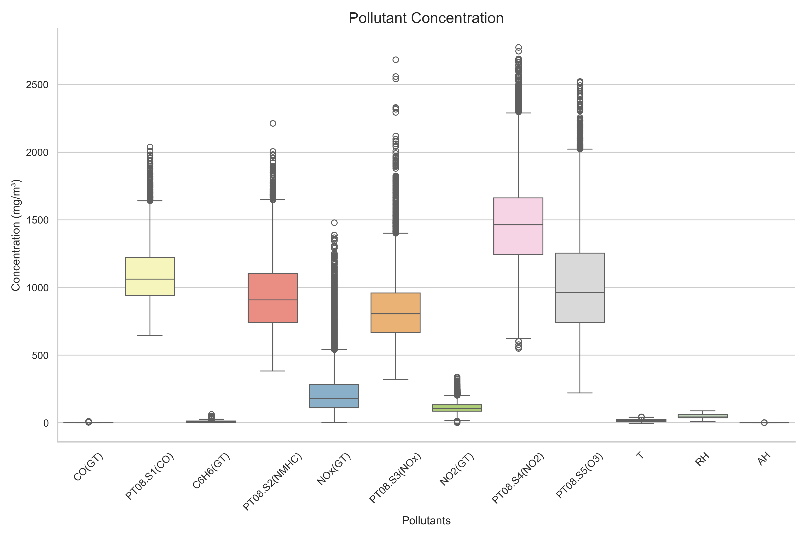
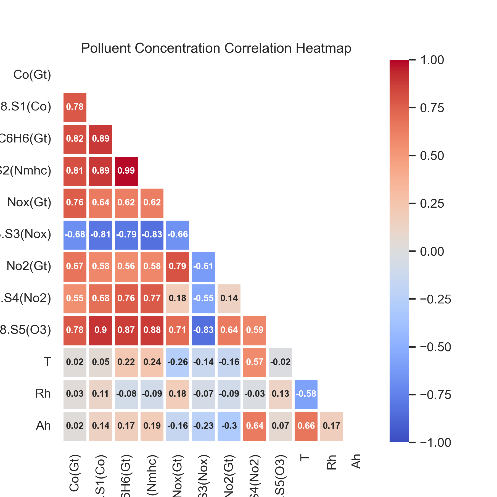
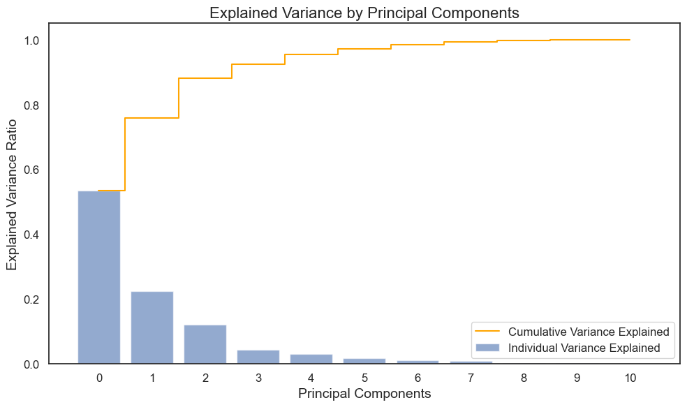
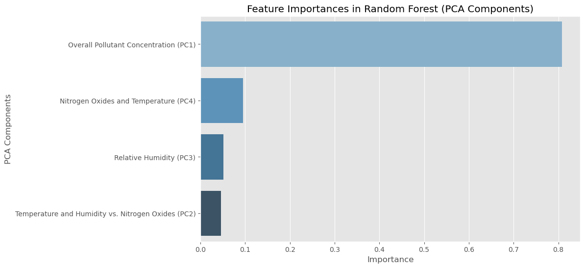
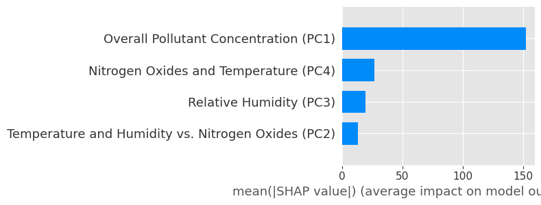

# Urban Airscape: Determinants of Air Quality in City Environments


## 📌 Context

Air pollution has become a growing concern for public health, with recent years showing an alarming rise in pollution levels. This increase is attributed to both natural events, such as wildfires, and human activities like land-use changes, agriculture-driven fires, transportation, and industries. Among these, human-induced pollutants have been extensively studied for their detrimental effects on air quality. Air pollution has increasingly become a significant public health concern, with recent years witnessing a worrying rise in pollution levels. These human-induced pollutants stem from sources like land-use changes, agriculture-driven fires, transportation, industrial manufacturing, energy production, and residential heating. Among these, the impact of human-induced pollutants has been particularly detrimental to air quality, with key pollutants including carbon monoxide (CO), nitrogen oxides (NOx), volatile organic compounds (VOCs), and particulate matter (PM).

For instance, carbon monoxide (CO) is primarily emitted from vehicle exhaust and incomplete combustion in industrial processes. Nitrogen oxides (NOx), which include nitrogen dioxide (NO2), are released during high-temperature combustion in power plants, automobiles, and ships. Non-methane hydrocarbons (NMHCs) and benzene (C6H6) originate from motor vehicles, industrial activities, and the evaporation of organic solvents. Ozone (O3), although not directly emitted, is a secondary pollutant formed when NOx and VOCs interact with sunlight in the atmosphere, contributing to ground-level ozone, a key component of smog.

Each of these pollutants is associated with different sectors:
- **CO** is predominantly emitted through vehicle exhaust and poorly ventilated combustion sources like heaters.
- **NOx** emissions come from the burning of fossil fuels in cars, trucks, power plants, and construction equipment.
- **NMHCs** and **C6H6** are byproducts of the combustion of fossil fuels and evaporation from chemical production or fuel storage.
- **Ozone (O3)** forms when NOx and VOCs undergo chemical reactions in the presence of sunlight, mainly due to industrial emissions and vehicular traffic.

These pollutants (such as CO, NOx, NMHCs, and O3) severely degrade air quality, leading to respiratory problems, cardiovascular diseases, and long-term environmental harm. As industrialization and urbanization continue to expand globally, controlling these emissions becomes increasingly vital for safeguarding public health.

### **Objectives:**

This project focuses on analyzing and predicting air quality levels based on meteorological data and pollutant concentration across various regions. It integrates exploratory data analysis (EDA) and machine learning regression models to understand air pollution concentrations through time and the relationships between environmental factors and air quality. The goal is to analyze how various air pollutants and environmental factors are related to the concentration of **PT08.S1 (CO)**, which measures carbon monoxide (CO) levels in the atmosphere. By investigating the contributions of other pollutants and environmental variables, such as temperature and humidity, the study aims to identify the primary drivers of CO pollution. This insight can inform strategies for improving air quality and public health outcomes.

This project aims to address the following key questions:
- **When** are pollutant concentrations highest?  
   - Specifically, where are the CO concentrations the highest? 
   - This includes analyzing the hours, days, weeks, and months of the year with the highest recorded concentrations of CO.

- **What** is the relationship between CO concentrations and other factors?  
   - Specifically, how do other air pollutants and environmental variables such as temperature and humidity impact the concentration of **PT08.S1 (CO)**?

### Steps

This study is based on a real-world dataset used in a data science job interview. The project demonstrates key techniques, including:
- Missing data handling
- Outlier treatment 
- Dimensionality reduction 
- Regression model construction
- Model evaluation

## Dataset

The dataset contains 9,358 averaged measurements from 5 chemical sensors of a multisensor device (PTXX.SX). This device was positioned at street level in a heavily polluted city. The data was collected over the course of one year, from March 2004 to February 2005. Missing values are marked with -200, and two columns are intentionally inserted as all NaN. In addition to the chemical sensor data, some environmental variables were also recorded, such as humidity, absolute humidity, and temperature.

### Dataset Features

1. **Date (DD/MM/YYYY)**: The date of the measurement in day/month/year format.
2. **Time (HH.MM.SS)**: The time of the measurement in hours.minutes.seconds format.
3. **PT08.S1 (CO)**: The concentration of carbon monoxide (CO) in the atmosphere, which is the target variable.
4. **Non-Methane Hydrocarbons (NMHC) Concentration (mg/m^3)**: The concentration of non-methane hydrocarbons, which are volatile organic compounds (VOCs) other than methane.
5. **Benzene Concentration (mg/m^3)**: The concentration of benzene, a harmful volatile organic compound (VOC).
6. **PT08.S2 (NMHC)**: The second sensor’s response related to non-methane hydrocarbons.
7. **NOx Concentration (ppb)**: The concentration of nitrogen oxides (NO and NO2), common air pollutants.
8. **PT08.S3 (NOx)**: The third sensor’s response related to nitrogen oxides.
9. **NO2 Concentration (mg/m^3)**: The concentration of nitrogen dioxide, another harmful air pollutant.
10. **PT08.S4 (NO2)**: The fourth sensor’s response related to nitrogen dioxide.
11. **PT08.S5 (O3)**: The fifth sensor’s response related to ozone (O3).
12. **Temperature (C)**: The ambient temperature, recorded in degrees Celsius.
13. **Relative Humidity (%)**: The percentage of moisture in the air relative to the maximum possible.
14. **Absolute Humidity (AH)**: The total amount of water vapor in the air, regardless of temperature, measured in grams per cubic meter.

## Exploratory Data Analysis (EDA)

### Dealing with Missing Values

From the initial data summary and heatmap analysis, we observe that two columns (`Unnamed: 15` and `Unnamed: 16`) contain only null values. The remaining columns have some missing values, with a consistent tail of 114 null entries across these columns.

The columns `Unnamed: 15` and `Unnamed: 16` contain entirely null values. Since there is no prior information on their relevance, I chose to remove these columns entirely from the dataset. In this dataset, missing values are represented by `-200`, as noted in the data description. Therefore, we must account for both these placeholder values and the actual missing entries.

Given the summary of missing data and the distribution of our numeric features, we will handle the missing data as follows:

**Removal of `NMHC(GT)`**: Since `NMHC(GT)` has over 90% missing data, we chose to remove this column entirely from our analysis. Imputing such a large proportion of missing data could lead to unreliable results.

**Handling the Remaining Missing Values**: For the remaining variables, the missing values range from 3.91% to 17.5%. Given the manageable proportions and the skewness observed in some distributions, we decided to impute the missing values using the **median** for each variable.

#### Outlier Detection and Treatment



From the boxplots, it is evident that outliers are present, particularly in the pollutant-related variables. These outliers could distort our model, leading to skewed results and misleading insights. To handle these anomalies, it is essential to apply appropriate transformation techniques.

To handle outliers in our dataset, we first detect the number of outliers for each numeric feature using the **Interquartile Range (IQR) method**. 

##### What is the IQR Method for Detecting Outliers?

The IQR method is a common technique for identifying outliers in a dataset. The IQR is the range between the 75th percentile (Q3) and the 25th percentile (Q1), representing the middle 50% of the data. An outlier is typically defined as any data point that falls below **Q1 - 1.5 * IQR** or above **Q3 + 1.5 * IQR**. These thresholds help flag data points that are significantly different from the rest of the observations.

Using our custom `count_outlier_iqr` function, we identified the number of outliers in each numeric feature.

##### IQR Transformation for Outlier Treatment

After detecting the outliers, we applied an **IQR transformation** using the `iqr_transform` function. 

##### How the IQR Transformation Works

The IQR transformation limits the influence of outliers by capping extreme values. Instead of removing them, it replaces values that exceed the thresholds (**Q1 - 1.5 * IQR** or **Q3 + 1.5 * IQR**) with the nearest boundary value. For instance, values lower than **Q1 - 1.5 * IQR** are set to that threshold, while values higher than **Q3 + 1.5 * IQR** are capped at **Q3 + 1.5 * IQR**.

##### Why I Chose the IQR Transformation

The reason for choosing this approach is to maintain the structure of the data without discarding any observations, which could potentially reduce valuable information. By capping extreme values, we reduce the impact of outliers on our models while still keeping those data points for future analysis.

### Seeing Pollutant Variation Through Time 

To address our first question: 
- **When** are pollutant concentrations highest?  
   - Specifically, where are the CO concentrations the highest? 
   - This includes analyzing the hours, days, weeks, and months of the year with the highest recorded concentrations of CO.

I implemented a calendar heatmap that visualizes pollutant concentrations over time, highlighting periods of peak pollution for further analysis.

```python
def calendar_heatmap(df, pollutant_column, save_dir=None):
    """
    Generate a calendar heatmap for the specified pollutant column, with mean pollutant concentration per day.
    
    Parameters:
    df (pandas.DataFrame): The input DataFrame.
    pollutant_column (str): The name of the pollutant column to generate the calendar heatmap for.
    save_dir (str): Optional. Directory where the figure should be saved. If None, the figure is only displayed.
    
    Returns:
    Saves the calendar heatmap as an image and/or displays it.
    """

    # Ensure 'Date' is in datetime format
    if not pd.api.types.is_datetime64_any_dtype(df['Date']):
        df['Date'] = pd.to_datetime(df['Date'], format='%d/%m/%Y')

    # Extract year, month, day, and weekday
    df['Year'] = df['Date'].dt.year
    df['Month'] = df['Date'].dt.month
    df['Day'] = df['Date'].dt.day
    df['Weekday'] = df['Date'].dt.weekday

    # Compute daily means
    daily_means = df.groupby(['Year', 'Month', 'Day'])[pollutant_column].mean().reset_index()
    daily_means.columns = ['Year', 'Month', 'Day', 'MeanPollutant']

    # Get unique years for subplots
    years = daily_means['Year'].unique()
    num_years = len(years)

    # Set up subplots
    fig, axs = plt.subplots(1, num_years, figsize=(20, 5), constrained_layout=True)

    # Loop through each year and generate heatmap
    for i, year in enumerate(years):
        year_data = daily_means[daily_means['Year'] == year]

        # Create pivot table for heatmap
        pivot_table = year_data.pivot_table(index='Month', columns='Day', values='MeanPollutant')

        # Handle months with fewer than 31 days by filling with NaN
        pivot_table = pivot_table.reindex(index=np.arange(1, 13), columns=np.arange(1, 32))
        
        # Replace numerical month values with month abbreviations
        pivot_table.index = pivot_table.index.map(lambda x: calendar.month_abbr[x])

        # Generate heatmap
        sns.heatmap(pivot_table, cmap='RdYlGn_r', ax=axs[i], linewidths=0.5, linecolor='grey',
                    cbar_kws={'label': 'Pollutant Concentration'})
        axs[i].set_title(f'Year: {year}', fontsize=12)
        axs[i].set_xlabel('Day', fontsize=10)
        axs[i].set_ylabel('Month', fontsize=10)

    # Set global title
    plt.suptitle(f'Calendar Heatmap of {pollutant_column} Concentrations', fontsize=16)

    # Save the figure if the save_dir is provided
    if save_dir:
        # Ensure the directory exists
        os.makedirs(save_dir, exist_ok=True)
        
        # Create the filename based on the pollutant
        file_path = os.path.join(save_dir, f'calendar_heatmap_{pollutant_column}.png')
        
        # Save the figure
        plt.savefig(file_path, bbox_inches='tight', dpi=300)
        print(f"Figure saved at: {file_path}")
    
    # Show the plot
    plt.show()
```
#### Insights from Calendar Heatmap


.png)

By visually inspecting the calendar for both 2004 and 2005, a few key insights about CO² pollution levels emerge:

**March Patterns**: Both years show a concentration of high CO² pollution during the second to third weeks of March.

**Notable Spikes**:

The **highest recorded CO²** levels appear at the end of November 2004.
There are also **significant peaks** observed in mid-February, and towards the end of both October and December 2004.

These observations suggest certain periods of the year may experience higher pollution levels, which could be influenced by seasonal or environmental factors. This will be explored further.

### Visualizing Pollutant Variation Through Time

To further explore pollutant concentration patterns, I implemented the `plot_pollutant_variations` function. This function provides detailed visualizations of pollutant concentrations by hour, month, and day of the week, allowing us to pinpoint peak levels for each pollutant.

```python
def plot_pollutant_variations(df, pollutants, ylabel='Concentration', save_dir=None):
    """
    Plots pollutant concentration variations by hour, month, and day of the week for multiple pollutants,
    highlighting the peak values in each variation (hourly, monthly, weekly).
    
    Parameters:
    df (DataFrame): Input DataFrame containing pollutant data.
    pollutants (list): List of pollutant column names to plot.
    ylabel (str, optional): Y-axis label. Default is 'Concentration'.
    save_dir (str, optional): Directory where the figure should be saved. If None, figures are only displayed.
    """
    
    # Ensure correct datetime parsing
    df['Time'] = pd.to_datetime(df['Time'], format='%H.%M.%S', errors='coerce')
    df['Date'] = pd.to_datetime(df['Date'], errors='coerce')

    # Convert pollutant columns to numeric
    for pollutant in pollutants:
        df[pollutant] = pd.to_numeric(df[pollutant], errors='coerce')

    # Drop rows with missing values
    df = df[['Time', 'Date'] + pollutants].dropna()

    # Color palette for the pollutants
    colors = sns.color_palette("husl", len(pollutants))

    # Loop through each pollutant to generate plots
    for idx, pollutant in enumerate(pollutants):
        fig, axes = plt.subplots(1, 3, figsize=(20, 6))
        fig.suptitle(f'Pollutant: {pollutant}', fontsize=20)

        # Hourly Variation
        df['Hour'] = df['Time'].dt.hour
        hourly_data = df.groupby('Hour')[pollutant].agg(['mean', 'std']).reset_index()
        axes[0].plot(hourly_data['Hour'], hourly_data['mean'], color=colors[idx], linewidth=2)
        axes[0].fill_between(hourly_data['Hour'], 
                             hourly_data['mean'] - hourly_data['std'], 
                             hourly_data['mean'] + hourly_data['std'], 
                             color=colors[idx], alpha=0.3)
        axes[0].set_title('Hourly Variation', fontsize=16)
        axes[0].set_xlabel('Hour', fontsize=14)
        axes[0].set_ylabel(ylabel, fontsize=14)
        axes[0].set_xticks(np.arange(0, 24, 1))

        # Add vline at peak hour (maximum concentration)
        peak_hour = hourly_data.loc[hourly_data['mean'].idxmax(), 'Hour']
        axes[0].axvline(x=peak_hour, color='red', linestyle='--', label='Peak Hour')
        axes[0].legend()

        # Monthly Variation
        df['Month'] = df['Date'].dt.month
        month_data = df.groupby('Month')[pollutant].agg(['mean', 'std']).reset_index()
        axes[1].plot(month_data['Month'], month_data['mean'], color=colors[idx], linewidth=2)
        axes[1].fill_between(month_data['Month'], 
                             month_data['mean'] - month_data['std'], 
                             month_data['mean'] + month_data['std'], 
                             color=colors[idx], alpha=0.3)
        axes[1].set_title('Monthly Variation', fontsize=16)
        axes[1].set_xlabel('Month', fontsize=14)
        axes[1].set_xticks(np.arange(1, 13, 1))
        axes[1].set_xticklabels(['Jan', 'Feb', 'Mar', 'Apr', 'May', 'Jun',
                                 'Jul', 'Aug', 'Sep', 'Oct', 'Nov', 'Dec'], fontsize=12)

        # Add vline at peak month (maximum concentration)
        peak_month = month_data.loc[month_data['mean'].idxmax(), 'Month']
        axes[1].axvline(x=peak_month, color='red', linestyle='--', label='Peak Month')
        axes[1].legend()

        # Weekly Variation
        df['DayOfWeek'] = df['Date'].dt.dayofweek
        week_data = df.groupby('DayOfWeek')[pollutant].agg(['mean', 'std']).reset_index()
        axes[2].plot(week_data['DayOfWeek'], week_data['mean'], color=colors[idx], linewidth=2)
        axes[2].fill_between(week_data['DayOfWeek'], 
                             week_data['mean'] - week_data['std'], 
                             week_data['mean'] + week_data['std'], 
                             color=colors[idx], alpha=0.3)
        axes[2].set_title('Weekly Variation', fontsize=16)
        axes[2].set_xlabel('Day of Week', fontsize=14)
        axes[2].set_xticks(np.arange(0, 7, 1))
        axes[2].set_xticklabels(['Mon', 'Tue', 'Wed', 'Thu', 'Fri', 'Sat', 'Sun'], fontsize=12)

        # Add vline at peak day of the week (maximum concentration)
        peak_day = week_data.loc[week_data['mean'].idxmax(), 'DayOfWeek']
        axes[2].axvline(x=peak_day, color='red', linestyle='--', label='Peak Day')
        axes[2].legend()

        # Adjust layout and show plot
        plt.tight_layout(rect=[0, 0.03, 1, 0.95])

        # Save the figure if save_dir is provided
        if save_dir:
            # Ensure the directory exists
            os.makedirs(save_dir, exist_ok=True)
            
            # Define the file path
            file_path = os.path.join(save_dir, f'{pollutant}_variation.png')
            
            # Save the figure
            plt.savefig(file_path, bbox_inches='tight', dpi=300)
            print(f"Figure saved at: {file_path}")

        # Show the figure
        plt.show()
```

_variation.png)
_variation.png)
_variation.png)
_variation.png)
_variation.png)
_variation.png)
_variation.png)
_variation.png)

### Pollutant Concentration Insights

| Pollutant       | Hour  | Month    | Day           |
|------------------|-------|----------|---------------|
| **NMHC(GT)**     | 19:00 | October  | Friday        |
| **NOx(GT)**      | 19:00 | November | Friday        |
| **NOx**          | 04:00 | May      | Sunday-Monday |
| **NO2(GT)**      | 19:00 | February | Friday        |
| **NO2**          | 19:00 | June     | Friday        |
| **O3**           | 19:00 | November | Thursday      |

#### Key Patterns:
- **19:00** is the peak hour for most pollutants, likely due to rush hour traffic.
- **November** shows high pollutant concentrations, possibly due to temperature inversions.
- **Fridays** consistently show peak pollution levels, likely from weekday activities and travel.

### Gaining Insights from Feature Correlations



The following are the main insights from the correlation matrix, focusing on features highly correlated with **PT08.S1 (CO)**, our target variable representing carbon monoxide concentration in the atmosphere.

#### Key Correlations with PT08.S1 (CO)
- **PT08.S5 (O3)**: Strongest positive correlation (**0.90**), indicating a strong linear relationship between ozone levels and CO concentrations.
- **PT08.S2 (NMHC)**: Positive correlation (**0.89**) suggests a strong association between non-methane hydrocarbons and CO levels.
- **C6H6 (Benzene)**: Positive correlation (**0.78**) implies benzene levels rise alongside CO concentrations.
- **NOx (GT)**: Moderate positive correlation (**0.63**), indicating a weaker but still significant relationship with CO concentrations.

#### Negative Correlations
- **PT08.S3 (NOx)**: Negative correlation (**-0.81**) may reflect a different aspect of NOx not directly tracking CO in the same way.

#### Low Correlations
- **Temperature (T)**: Weak correlation (**0.06**) suggests minimal impact on CO levels.
- **Relative Humidity (RH)**: Weak correlation (**0.11**) implies it is not a major factor for CO variability.

---


### Multicollinearity and Dimensionality Reduction

#### Observing Multicollinearity
- **PT08.S5 (O3)** and **PT08.S2 (NMHC)**: Correlation of **0.88**.
- **PT08.S2 (NMHC)** and **C6H6 (Benzene)**: Correlation of **0.86**.
- **PT08.S4 (NO2)** and **PT08.S2 (NMHC)**: Correlation of **0.77**.

Such high correlations among independent variables can introduce multicollinearity, complicating regression modeling by inflating standard errors and reducing the reliability of coefficient estimates.

#### Addressing Multicollinearity
To handle multicollinearity, **Principal Component Analysis (PCA)** was applied:
1. **Standardization**: All covariates were standardized to have a mean of 0 and a standard deviation of 1.
2. **Eigenvalues and Variance Explained**: The eigenvalues and cumulative variance explained by the principal components were computed.
3. **Selection of Principal Components**: Based on the cumulative variance explained, four components were retained.

---

### PCA Results

#### Explained Variance
| Principal Component | Eigenvalue | Cumulative Variance (%) |
|---------------------|------------|--------------------------|
| **1**               | 5.8758     | 53.41                   |
| **2**               | 2.4741     | 75.90                   |
| **3**               | 1.3344     | 88.03                   |
| **4**               | 0.4826     | 92.42                   |

#### Visualization of Explained Variance


---

#### Why Four Components?

**Four principal components** were selected to balance explained variance with model simplicity:

1. **Variance Explained**: 
   - These four components capture **92.42%** of the total variance, effectively summarizing the dataset.
2. **Diminishing Returns**:
   - Additional components contribute minimal variance (e.g., the fifth component adds only **3.06%**).
3. **Interpretability**:
   - A reduced number of components simplifies interpretation while preserving meaningful data patterns.

#### Conclusion
Retaining four principal components strikes the right balance between variance explanation and model interpretability. These components will serve as the foundation for subsequent regression modeling and prediction tasks.


##### Factor Analysis: Analysing Feature Contribution to Principal Components

The following code extracts the loadings for the four PC we setted

```python
loadings = pd.DataFrame(
    PCA_4.components_.T * np.sqrt(PCA_4.explained_variance_),  
    index=X_scaled.columns, 
    columns=['PC1', 'PC2', 'PC3', 'PC4']  
)

component_names = [
    "Overall Pollutant Concentration (PC1)",
    "Temperature and Humidity vs. Nitrogen Oxides (PC2)",
    "Relative Humidity (PC3)",
    "Nitrogen Oxides and Temperature (PC4)"
]


loadings.columns = component_names


loadings = loadings.round(2)


loadings.head()
```

And return this table: 

| Feature           | Overall Pollutant Concentration (PC1) | Temperature and Humidity vs. Nitrogen Oxides (PC2) | Relative Humidity (PC3) | Nitrogen Oxides and Temperature (PC4) |
|-------------------|----------------------------------------|---------------------------------------------------|-------------------------|---------------------------------------|
| **CO(GT)**        | 0.89                                   | -0.15                                              | -0.04                   | -0.03                                |
| **C6H6(GT)**      | 0.95                                   | 0.11                                               | -0.04                   | -0.23                                |
| **PT08.S2(NMHC)** | 0.96                                   | 0.13                                               | -0.06                   | -0.18                                |
| **NOx(GT)**       | 0.76                                   | -0.49                                              | 0.02                    | 0.29                                 |
| **PT08.S3(NOx)**  | -0.88                                  | -0.01                                              | -0.09                   | -0.17                                |


This allow us to gain insight into the underlying structure of the data. This interpretation is crucial for understanding which variables influence each component and how the reduction in dimensionality improves interpretability without sacrificing too much variance.

##### **PC1: Overall Pollutant Concentration**
- **Explanation**: This component was named "Overall Pollutant Concentration" because it captures a broad measure of air pollutants, driven by multiple volatile organic compounds.
- **Key Variables**:
  - **PT08.S2(NMHC)** has the highest loading, indicating a significant contribution to this component, reflecting concentrations of organic air pollutants.
  - **C6H6(GT)** and **PT08.S5(O3)** also contribute positively, reinforcing that this component encapsulates a wide range of pollutants.
  
The high cumulative variance captured by PC1 (~32.38%) justifies this interpretation, as it represents the direction of maximum variance related to overall pollutant levels in the dataset.

##### **PC2: Temperature and Humidity vs. Nitrogen Oxides**
- **Explanation**: PC2 highlights the contrast between temperature and humidity effects and nitrogen oxide levels, hence the name "Temperature and Humidity vs. Nitrogen Oxides."
- **Key Variables**:
  - **T** (temperature) and **AH** (absolute humidity) contribute strongly to this component, representing atmospheric conditions.
  - **NOx(GT)** has a notable negative loading, indicating an inverse relationship with temperature and humidity.
  
This component captures an important interaction between environmental factors and pollutants, and its interpretation aligns with the trade-off between explaining additional variance and maintaining simplicity.

###### **PC3: Relative Humidity**
- **Explanation**: PC3 is dominated by **RH** (relative humidity), suggesting this component mainly reflects moisture levels in the atmosphere, which is why it was named "Relative Humidity."
- **Key Variables**:
  - **RH** has a very high positive loading, indicating it is the primary driver of this component.
  - **T** contributes negatively, suggesting a relationship between temperature and humidity.
  
Choosing this PC adds interpretability related to meteorological effects, which are essential for understanding air quality variations driven by humidity levels.

###### **PC4: Nitrogen Oxides and Temperature**
- **Explanation**: The fourth component highlights contributions from nitrogen oxide variables, **NO2(GT)** and **PT08.S4(NO2)**, with temperature also playing a role. This led to the name "Nitrogen Oxides and Temperature."
- **Key Variables**:
  - **NO2(GT)** and **PT08.S4(NO2)** exhibit significant loadings, representing nitrogen oxide pollution.
  - The negative loading of **PT08.S4(NO2)** suggests an inverse effect within this component.

By including PC4, we capture specific pollution patterns related to nitrogen oxides, which are crucial for air quality studies, enhancing interpretability while explaining additional variance (~91.46% cumulative).

---

##### Conclusion: Balancing Variance and Interpretability

In selecting four principal components, we strike a balance between maximizing the variance explained (~91.46%) and maintaining interpretability. Each component reflects a distinct aspect of the dataset:
- PC1 emphasizes general pollutant concentration.
- PC2 captures environmental conditions.
- PC3 isolates humidity effects.
- PC4 focuses on nitrogen oxides.

This approach avoids overfitting and ensures that the results remain interpretable, enabling us to draw meaningful conclusions about air quality dynamics. Each principal component represents a different dimension of variability, allowing for a clearer understanding of the relationships between pollutants and environmental factors.

## Machine Learning Regression: Predicting CO Concentration

In this section, we will dive into our machine learning regression model to address one of the core questions of our project. We aim to leverage insights gained from our exploratory data analysis (EDA) and use the **Principal Component Analysis (PCA)** components as features to predict the target variable **PT08.S1 (CO)**. 

### Understanding the Target Variable
**PT08.S1 (CO)** represents the concentration of carbon monoxide (CO) as measured by a specific sensor. CO is a harmful air pollutant, and its concentration can be influenced by various environmental and atmospheric factors.

### **Objective 2**
The specific research question we aim to answer in this section is:

**What is the relationship between CO concentrations and other factors?**
- More specifically, we want to explore how other air pollutants and environmental variables, such as temperature and humidity, impact the concentration of **PT08.S1 (CO)**.

To achieve this, we will:
1. Use the PCA component scores as predictors in our regression model.
2. Evaluate how well these components, which summarize air pollutants and environmental conditions, explain the variations in CO levels.

This analysis will allow us to gain a deeper understanding of the interactions between CO and other key variables, ultimately helping us model the factors that contribute to fluctuations in carbon monoxide concentration.


## Factor Analysis: Analyzing Feature Contribution to Principal Components

### Principal Component Loadings

To understand how each feature contributes to the selected four principal components, we extracted the loadings. The loadings quantify the contribution of each feature to a principal component. Here's the resulting table:

| Feature            | Overall Pollutant Concentration (PC1) | Temperature and Humidity vs. Nitrogen Oxides (PC2) | Relative Humidity (PC3) | Nitrogen Oxides and Temperature (PC4) |
|--------------------|----------------------------------------|---------------------------------------------------|-------------------------|---------------------------------------|
| **CO(GT)**         | 0.89                                   | -0.15                                              | -0.04                   | -0.03                                |
| **C6H6(GT)**       | 0.95                                   | 0.11                                               | -0.04                   | -0.23                                |
| **PT08.S2(NMHC)**  | 0.96                                   | 0.13                                               | -0.06                   | -0.18                                |
| **NOx(GT)**        | 0.76                                   | -0.49                                              | 0.02                    | 0.29                                 |
| **PT08.S3(NOx)**   | -0.88                                  | -0.01                                              | -0.09                   | -0.17                                |

---

### **PC1: Overall Pollutant Concentration**
- **Explanation**: Captures general air pollution levels driven by volatile organic compounds.
- **Key Variables**:
  - **PT08.S2(NMHC)**: Strongest contributor, representing organic pollutant concentrations.
  - **C6H6(GT)** and **CO(GT)**: Positive contributors, reinforcing this component as a broad pollutant measure.
- **Cumulative Variance Explained**: ~53.41%.

### **PC2: Temperature and Humidity vs. Nitrogen Oxides**
- **Explanation**: Represents a contrast between atmospheric conditions (temperature, humidity) and nitrogen oxides.
- **Key Variables**:
  - **T (Temperature)** and **AH (Absolute Humidity)**: Positive contributors, reflecting environmental factors.
  - **NOx(GT)**: Negative contributor, indicating an inverse relationship with temperature and humidity.

### **PC3: Relative Humidity**
- **Explanation**: Focuses on atmospheric moisture levels.
- **Key Variables**:
  - **RH (Relative Humidity)**: Dominant positive contributor.
  - **T (Temperature)**: Negative loading, showing a trade-off with humidity levels.

### **PC4: Nitrogen Oxides and Temperature**
- **Explanation**: Highlights specific nitrogen oxide patterns and temperature effects.
- **Key Variables**:
  - **NO2(GT)** and **PT08.S4(NO2)**: Key nitrogen oxide contributors.
  - **Temperature**: Shows a role in this component's variability.

---

## Machine Learning Regression: Predicting CO Concentration

### Objective
We aim to predict the target variable **PT08.S1 (CO)** using the PCA-transformed features. The analysis will provide insights into how air pollutants and environmental factors influence CO concentrations.

---

### Regression Model Analysis and Results

#### Step 1: Model Training and Evaluation
We evaluated four regression models:
1. **Random Forest Regressor**
2. **Ridge Regression**
3. **Support Vector Regressor (SVR)**
4. **XGBoost Regressor**

Each model was evaluated using:
- **Root Mean Squared Error (RMSE)**
- **R² (Coefficient of Determination)**

#### Step 2: Model Comparison

| Model                  | RMSE  | R²    |
|------------------------|-------|-------|
| **Random Forest**      | 65.86 | 0.91  |
| **XGBoost**            | 68.95 | 0.90  |
| **Support Vector (SVR)**| 94.05 | 0.80  |
| **Ridge Regression**   | 80.93 | 0.86  |

- **Random Forest** and **XGBoost** achieved the best performance with **R² ≈ 0.91**, explaining 91% of the variance in CO concentrations.
- **Ridge Regression** and **SVR** underperformed compared to tree-based models.

#### Step 3: Final Model Selection
Based on performance metrics and interpretability:
- **Random Forest** was selected for its high accuracy and ability to extract feature importance.

---

### Random Forest Hyperparameter Tuning

Using **GridSearchCV**, we optimized the following hyperparameters:
- **n_estimators**: 100, 200, 300.
- **max_depth**: None, 10, 20, 30.
- **min_samples_split**: 2, 5, 10.
- **max_features**: auto, sqrt, log2.

#### Best Parameters
| Hyperparameter       | Value    |
|----------------------|----------|
| **n_estimators**     | 300      |
| **max_depth**        | 20       |
| **min_samples_split**| 2        |
| **max_features**     | sqrt     |

---

### Feature Importance from Random Forest

After tuning, we extracted feature importance to quantify each PCA component's contribution to predicting CO concentration.

| Feature                                            | Importance |
|----------------------------------------------------|------------|
| **Overall Pollutant Concentration (PC1)**         | 0.808      |
| **Nitrogen Oxides and Temperature (PC4)**         | 0.095      |
| **Relative Humidity (PC3)**                       | 0.051      |
| **Temperature and Humidity vs. Nitrogen Oxides (PC2)** | 0.045      |

#### Insights
- **PC1 (Overall Pollutant Concentration)** is the dominant predictor, accounting for ~81% of the model's importance.
- **PC4 (Nitrogen Oxides and Temperature)** provides additional predictive power, capturing specific pollutant and environmental interactions.
- **PC3 and PC2** contribute less but are still relevant for fine-tuning predictions.

---

### Final Model Performance
| Metric   | Value    |
|----------|----------|
| **RMSE** | 65.86    |
| **R²**   | 0.91     |

The **Random Forest Regressor** explains 91% of the variance in CO concentrations, with an RMSE of 65.86, making it the most effective model for this analysis.

---

### Feature Importance Visualization
The following bar chart illustrates the importance of each PCA component in the Random Forest model:



---

### Conclusion
The analysis confirms that:
1. **Overall Pollutant Concentration (PC1)** is the primary driver of CO variability.
2. Incorporating **Nitrogen Oxides and Temperature (PC4)** adds meaningful predictive capability.
3. The PCA-based approach effectively reduces dimensionality while retaining interpretability, allowing us to identify key contributors to CO concentration fluctuations.


### SHAP Summary of Feature Importance (PCA Components)

| PCA Component | Feature Description                                | SHAP Importance |
|---------------|----------------------------------------------------|-----------------|
| **PC1**       | Overall Pollutant Concentration                   | **0.817**       |
| **PC4**       | Nitrogen Oxides and Temperature                   | 0.087           |
| **PC2**       | Temperature and Humidity vs. Nitrogen Oxides      | 0.053           |
| **PC3**       | Relative Humidity                                 | 0.044           |

#### 1. **PC1: Overall Pollutant Concentration**
   - **Importance**: SHAP confirms that PC1 dominates, accounting for **81.7%** of the total contribution.
   - **Implications**: This component aggregates pollutant concentrations, emphasizing that air pollutants are the primary drivers of CO levels.

#### 2. **PC4: Nitrogen Oxides and Temperature**
   - **Importance**: Contributes **8.7%** of the total SHAP value.
   - **Implications**: Captures the interplay between nitrogen oxides and temperature, which moderately impacts CO levels.

#### 3. **PC2: Temperature and Humidity vs. Nitrogen Oxides**
   - **Importance**: Contributes **5.3%** of the total SHAP value.
   - **Implications**: Highlights a weaker yet relevant interaction between atmospheric conditions and pollutants.

#### 4. **PC3: Relative Humidity**
   - **Importance**: Contributes only **4.4%**.
   - **Implications**: Reflects that relative humidity alone has a minimal effect on predicting CO levels.

---

### SHAP Visualizations



#### Summary Plot:
- Displays the distribution of SHAP values for each feature across all predictions.
- **Key Insight**: PC1 has the highest SHAP value range, reinforcing its dominant role.

#### Dependence Plots:
- Illustrate how SHAP values for individual features vary with their values.
- **Key Insight**: Higher values of PC1 consistently increase CO predictions, while the effects of PC4 and PC2 are more context-dependent.

---

### Conclusion and Insights

SHAP analysis provides a deeper understanding of the contributions of each PCA component in the **Random Forest** model:

1. **Dominance of PC1**: Confirmed as the most influential feature, indicating that managing overall pollutant concentrations can significantly improve air quality.
2. **Moderate Role of PC4**: Nitrogen oxides and temperature are relevant secondary factors.
3. **Minimal Impact of PC3**: Relative humidity has limited predictive value for CO levels in this dataset.

These insights align with feature importance results from the Random Forest model, strengthening confidence in the model’s interpretation. SHAP’s explainability ensures that predictions are transparent, aiding both scientific research and policymaking.

By using this results, stakeholders can identify critical factors to target for interventions, ensuring a more informed and impactful approach to air quality management.
